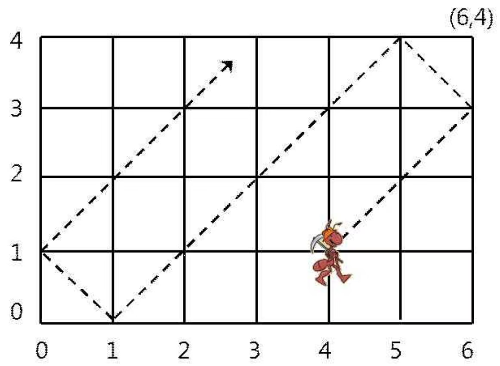

# [10158] 개미

### **난이도**
실버 3

## **📝문제**
가로 길이가 w이고 세로 길이가 h인 2차원 격자 공간이 있다. 이 격자는 아래 그림처럼 왼쪽 아래가 (0,0)이고 오른쪽 위가 (w,h)이다. 이 공간 안의 좌표 (p,q)에 개미 한 마리가 놓여있다. 개미는 오른쪽 위 45도 방향으로 일정한 속력으로 움직이기 시작한다. 처음에 (p,q)에서 출발한 개미는 1시간 후에는 (p+1,q+1)로 옮겨간다. 단, 이 속력으로 움직이다가 경계면에 부딪치면 같은 속력으로 반사되어 움직인다.



위 그림은 6×4 격자에서 처음에 (4,1)에서 출발한 개미가 움직인 길을 보여주고 있다. 처음에 (4,1)에 있는 개미는 2시간 후에 (6,3)에 있으며 8시간 후에 (0,1)에 있다. 만일 그 개미가 처음에 (5,3)에 있었다면 매 시간마다 (6,4), (5,3), (4,2), (3,1)로 움직인다. 

여러분은 크기 w×h인 격자 공간에서 처음에 (p,q)에서 출발하는 개미의 t시간 후의 위치 (x,y)를 계산하여 출력해야 한다. 개미는 절대 지치지 않고 같은 속력으로 이동한다고 가정한다. 

문제에서 w와 h는 자연수이며 범위는 2 ≤ w,h ≤ 40,000이다. 그리고 개미의 초기 위치 p와 q도 자연수이며 범위는 각각 0 < p < w과 0 < q < h이다. 그리고 계산할 시간 t의 범위는 1 ≤ t ≤ 200,000,000이다. 

### **입력**
첫줄에는 w와 h가 공백을 사이에 두고 주어진다. 그 다음 줄에는 초기 위치의 좌표값 p와 q가 공백을 사이에 두고 주어진다. 3번째 줄에는 개미가 움직일 시간 t가 주어진다. 

### **출력**
출력은 t 시간 후에 개미의 위치 좌표 (x,y)의 값 x와 y를 공백을 사이에 두고 출력한다. 

### **예제입출력**

**예제 입력1**

```
6 4
4 1
8
```

**예제 출력1**

```
0 1
```

**예제 입력2**

```
6 4
5 3
4
```

**예제 출력2**

```
3 1
```

### **출처**
Olympiad > 한국정보올림피아드 > 한국정보올림피아드시․도지역본선 > 지역본선 2014 > 중등부 2번

Olympiad > 한국정보올림피아드 > 한국정보올림피아드시․도지역본선 > 지역본선 2014 > 초등부 3번
## **🧐CODE REVIEW**

### **🧾나의 풀이**

```python
w, h = map(int, input().split())
start_x, start_y = map(int, input().split())

moving = int(input())
moving1 = moving

if moving <= w - start_x:
    
    now_x = start_x + moving
else:
    moving -= w - start_x
    how_many = moving // w
    moving_left = moving % w

    if how_many % 2:
        now_x = moving_left
    else:
        now_x = w - moving_left


if moving1 <= h - start_y:
    
    now_y = start_y + moving1

else:
    moving1 -= h - start_y
    how_many = moving1 // h
    up_left = moving1 % h

    if how_many % 2:
        now_y = up_left
    else:
        now_y = h - up_left
print(now_x, now_y)
```

결과	| 메모리(KB) |	시간(ms) |	언어 |	코드 길이(B)
:----:|:-----:|:-----:|:-----:|:--------:
정답|31252|44|Python3|614
#### **📝해설**

**알고리즘**
```
리스트를 순회하면서 해결하려면 괜히 시간만 오래 걸린다.
따라서 반복을 시행하지 않고 O(1)로 해결하기 위해 수학적으로 접근한다

결국 왼쪽오른쪽, 위아래로 항상 움직이지만 벽을 부딪히면
+1 하던 것을 -1로 부호가 바뀌는 식이다.

```

#### **😅개선점**

1. 조금 더 간결하고 알아보기 쉬운 코드로 풀이해보자


### **다른 풀이**

```python
w, h = map(int, input().split())
p, q = map(int, input().split())
t = int(input())

x = w - abs(w - ((p + t) % (2 * w)))
y = h - abs(h - ((q + t) % (2 * h)))

print(x, y)
```

### **나의 다른 풀이**

```python
w, h = map(int, input().split())
x, y = map(int, input().split())

t = int(input())

right_left = ((t + x) // w) % 2
up_down = ((t + y) // h) % 2

right_left_go = (t + x) % w
up_down_go = (t + y) % h

if right_left:
    now_x = w - right_left_go
    
else:
    now_x = right_left_go

if up_down:
    now_y = h - up_down_go
else:
    now_y = up_down_go

print(now_x, now_y)
```