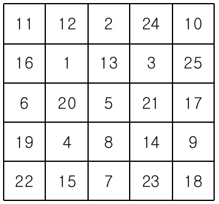
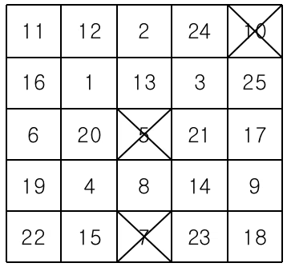
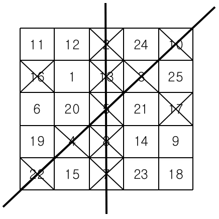
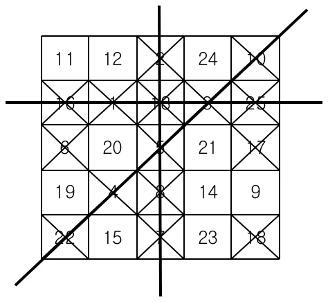

# [2578] 빙고

### **난이도**
실버 4

## **📝문제**
빙고 게임은 다음과 같은 방식으로 이루어진다.

먼저 아래와 같이 25개의 칸으로 이루어진 빙고판에 1부터 25까지 자연수를 한 칸에 하나씩 쓴다


다음은 사회자가 부르는 수를 차례로 지워나간다. 예를 들어 5, 10, 7이 불렸다면 이 세 수를 지운 뒤 빙고판의 모습은 다음과 같다.


차례로 수를 지워가다가 같은 가로줄, 세로줄 또는 대각선 위에 있는 5개의 모든 수가 지워지는 경우 그 줄에 선을 긋는다.


이러한 선이 세 개 이상 그어지는 순간 "빙고"라고 외치는데, 가장 먼저 외치는 사람이 게임의 승자가 된다.


철수는 친구들과 빙고 게임을 하고 있다. 철수가 빙고판에 쓴 수들과 사회자가 부르는 수의 순서가 주어질 때, 사회자가 몇 번째 수를 부른 후 철수가 "빙고"를 외치게 되는지를 출력하는 프로그램을 작성하시오.
### **입력**
첫째 줄부터 다섯째 줄까지 빙고판에 쓰여진 수가 가장 위 가로줄부터 차례대로 한 줄에 다섯 개씩 빈 칸을 사이에 두고 주어진다. 여섯째 줄부터 열째 줄까지 사회자가 부르는 수가 차례대로 한 줄에 다섯 개씩 빈 칸을 사이에 두고 주어진다. 빙고판에 쓰여진 수와 사회자가 부르는 수는 각각 1부터 25까지의 수가 한 번씩 사용된다.

### **출력**
첫째 줄에 사회자가 몇 번째 수를 부른 후 철수가 "빙고"를 외치게 되는지 출력한다.

### **예제입출력**

**예제 입력1**

```
11 12 2 24 10
16 1 13 3 25
6 20 5 21 17
19 4 8 14 9
22 15 7 23 18
5 10 7 16 2
4 22 8 17 13
3 18 1 6 25
12 19 23 14 21
11 24 9 20 15
```

**예제 출력1**

```
15
```


### **출처**
Olympiad > 한국정보올림피아드 > 한국정보올림피아드시․도지역본선 > 지역본선 2006 > 초등부 3번

Olympiad > 한국정보올림피아드 > 한국정보올림피아드시․도지역본선 > 지역본선 2006 > 중등부 2번

## **🧐CODE REVIEW**

### **😫나의 오답 풀이**
### **🧾나의 풀이**

```python
def bingoCheck(check):
    
    bingo = 0
    for i in range(5):
        if sum(check[i]) == 5:
            bingo += 1


    for i in range(5):
        temp = 0
        for j in range(5):
            temp += check[j][i]
        if temp == 5:
            bingo += 1
    temp = 0
    temp2 = 0
    for i in range(5):
        temp += check[i][i]
        temp2 += check[i][4-i]
    if temp == 5:
        bingo += 1
    if temp2 == 5:
        bingo += 1

    return bingo
    
board = [list(map(int, input().split())) for _ in range(5)]

bingo = [list(map(int, input().split())) for _ in range(5)]

bingo_list = []

for i in range(5):
    for j in range(5):
        bingo_list.append(bingo[i][j])

check = [[0] * 5 for _ in range(5)]

count = 0
bingo = 0

for i in range(25):
    count += 1
    number = bingo_list[i]

    for j in range(5):
        if number in board[j]:
            check[j][board[j].index(number)] = 1
            break
    
    if bingoCheck(check) >= 3:
        break
        
print(count)
```

결과	| 메모리(KB) |	시간(ms) |	언어 |	코드 길이(B)
:----:|:-----:|:-----:|:-----:|:--------:
정답|31120|64|Python3|1006
#### **📝해설**

**알고리즘**
```
1. 단순하게 배열을 순회하면서 한 숫자를 부를 때마다 빙고의 검사를 한다.
```

#### **😅개선점**

1. 조금더 복잡도를 줄일 수 있을 것 같다

### **다른 풀이**

```python
```

아이디 |	문제	| 문제 제목 |	결과	| 메모리(KB) |	시간(ms) |	언어 |	코드 길이(B) 
:-----:|:-----:|:---------:|:-----:|:-----:|:-----:|:----:|:--------:

#### **📝해설**

```python
board = [[*map(int, input().split())]for _ in[0]*5]

result, isBingo = 0, False
for _ in range(5):
    for n in map(int, input().split()):
        if isBingo: continue
        
        result += 1
        for i in range(5):
            for j in range(5):
                board[i][j] *= board[i][j] != n

        bingo_cnt = 0
        for i in range(5):
            bingo_cnt += sum(board[i]) == 0
            bingo_cnt += sum(board[j][i]for j in range(5)) == 0
        bingo_cnt += sum(board[i][i    ]for i in range(5)) == 0
        bingo_cnt += sum(board[i][-i-1 ]for i in range(5)) == 0
        isBingo = bingo_cnt >= 3
print(result)
```